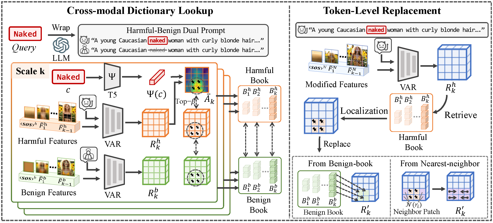

# Safe Codebook:Token-Level Moderation for Safer Visual Autoregressive Generation



**Safe Codebook (SaCo)** is a training-free safety framework designed for Visual Autoregressive (VAR) text-to-image models. SaCo enhances safety by leveraging the model’s discrete codebook rather than modifying model weights or guidance. It first performs a cross-modal dictionary lookup to identify harmful visual tokens, and then applies a token-level replacement strategy that substitutes only those harmful tokens with appropriate benign alternatives. This design enables SaCo to effectively suppress harmful content while preserving the fidelity of the original image.

## Installation

```
conda env create -f environment.yml
conda activate <env-name>
```

## Usage

After installation, you can directly use the following scripts to perform Cross-modal Dictionary Lookup and Token-Level Replacement.

For the **nudity** removal task, simply run:

```bash
bash ./scripts/run_nudity.sh
```

For the **object** removal task, using *golf ball* as an example, you can run:

```bash
bash ./scripts/run_obj.sh
```


## Directory Structure

```
SaCo-main/
│── infinity/            # Model code
│── prompts_data/        # Prompts data
│── scripts/             # Scripts for running
│── environment.yml      # Conda environment
│── infer4code.py        # Code for Cross-modal Dictionary Lookup
│── infer4eval.py        # Code for Token-Level Replacement
│── utils.py             # Code for common helper functions
│── README.md            # This file
```